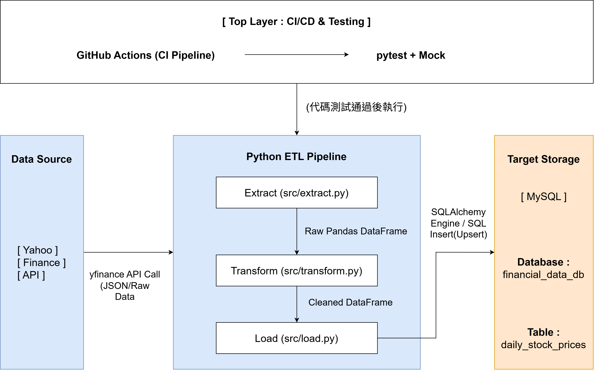

# 自動化金融市場數據 ETL 管線 (Automated Financial Data ETL Pipeline)

[](https://www.python.org/)
[](https://www.mysql.com/)

這是一個具備自動化測試的輕量級 ETL (Extract, Transform, Load) 資料管線專案。本專案透過 Python 自動擷取公開金融市場數據，進行資料清洗與轉型後，將結構化數據安全寫入 MySQL 關聯式資料庫，並結合 CI/CD 機制確保系統穩定度。

---

## 系統架構圖 (System Architecture)



---

## 專案亮點 (Key Features)

- **模組化架構 (SoC)**：將萃取 (Extract)、轉換 (Transform)、載入 (Load) 完全解耦，獨立建置於 `src/` 模組，確保程式碼具備高可讀性與高維護性。
- **資料品質與冪等性防護 (Idempotency)**：
  - MySQL Schema 採用 `(symbol, trade_date)` 複合唯一鍵 (Unique Key) 防範重覆寫入。
  - 價格欄位使用 `DECIMAL(10, 4)` 型態，完全避免浮點數計算誤差。
  - 交易量採用 `BIGINT` 防範極端行情下的數值溢位。
- **無副作用測試 (Mock Testing)**：使用 `pytest` 搭配 `unittest.mock` 技術，切斷真實 API 與資料庫依賴，確保商業邏輯穩定且可重複測試。
- **自動化持續整合 (CI/CD)**：結合 GitHub Actions，在每次推送程式碼時自動執行單元測試。
- **資安合規**：使用 `.env` 與 `.gitignore` 隔離敏感數據與連線憑證，杜絕密碼外洩風險。

---

## 技術堆疊 (Tech Stack)

- **Language**: Python 3.10+
- **Database**: MySQL 8.0+
- **Data Processing**: Pandas
- **Database Connector**: SQLAlchemy, mysql-connector-python
- **Testing**: Pytest, Mock
- **DevOps**: GitHub Actions, Virtual Environment (venv)

---

## 專案目錄結構 (Directory Structure)

```text
Automated_Financial_Data_ETL_Pipeline/
├── .gitignore               # Git 忽略檔案設定
├── .env                     # 環境變數設定檔 (不安裝至 Git)
├── README.md                # 專案說明文件
├── main.py                  # ETL 管線主要執行進入點
├── requirements.txt         # 依賴套件清單
├── images/                  # 專案靜態圖檔
│   └── architecture.png     # 系統架構圖
├── src/                     # ETL 核心模組
│   ├── extract.py           # 資料擷取模組
│   ├── transform.py         # 資料清洗與轉型模組
│   └── load.py              # 資料庫寫入模組
└── tests/                   # 單元測試腳本
    ├── test_extract.py
    ├── test_transform.py
    └── test_load.py
```

---

## 建立環境與安裝相依套件
```bash
# 建立並啟動虛擬環境
python -m venv venv
source venv/bin/activate  # Windows 請使用: .\venv\Scripts\activate

# 安裝套件
pip install -r requirements.txt
```

## 環境變數設定
```env
DB_HOST=localhost
DB_USER=your_username
DB_PASSWORD=your_password
DB_NAME=financial_data_db
DB_PORT=3306
```

## 資料庫建置 (MySQL)
```sql
CREATE DATABASE IF NOT EXISTS financial_data_db;
USE financial_data_db;

CREATE TABLE IF NOT EXISTS daily_stock_prices (
    id INT AUTO_INCREMENT PRIMARY KEY,
    symbol VARCHAR(10) NOT NULL,
    trade_date DATE NOT NULL,
    open_price DECIMAL(10, 4),
    close_price DECIMAL(10, 4),
    volume BIGINT,
    UNIQUE KEY unique_daily_price (symbol, trade_date)
) ENGINE=InnoDB DEFAULT CHARSET=utf8mb4;
```

## 執行 ETL 管線
```bash
python main.py
```

## 執行自動化測試
```bash
pytest -v
```

---
